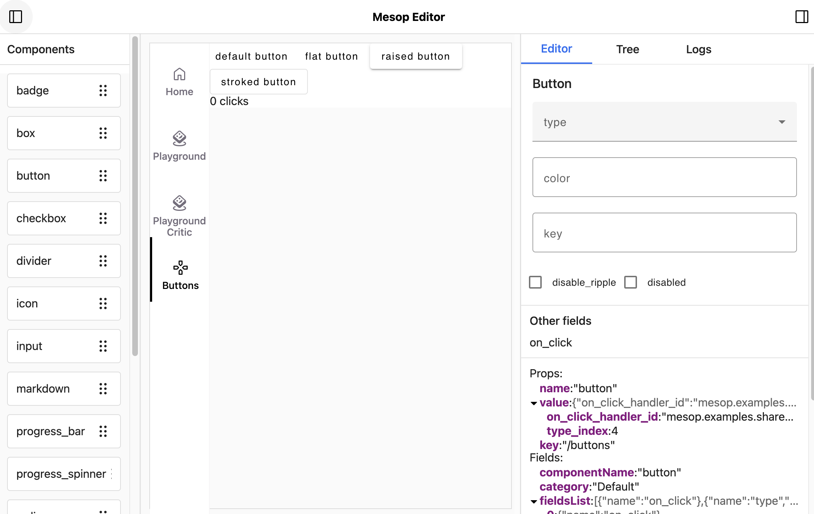

# Visual Editor Philosophy

## Motivation

As I began discussing Mesop with friends and colleagues, one thing that has come up is the difficulty of teaching and persuading non-frontend engineers to build UIs, even simple ones. CSS, particularly the rules around layout, can be quite challenging and off-putting.

I'm working on a new [visual editor](https://github.com/google/mesop/issues/31) for Mesop that aims to make UI building more approachable for beginners and more productive for experts.

## Prior Art

Visual editors (aka WYSIWYG builders) have been around for a long time. [Puck](https://github.com/measuredco/puck) is one of the most interesting ones because of a few reasons: 1) it's open-source, 2) it's flexible (e.g. bring your own components) and 3) it's intuitive and easy-to-use.

The main issues I saw with Puck, particularly for Mesop's use case, is that it [currently only supports React](https://github.com/measuredco/puck/issues/302) (and Mesop uses Angular) and Puck saves data whereas I would like Mesop's Visual Editor to directly emit/update code, which I'll explain next.

## Principles

### Hybrid code (not low-code)

One of the reasons why WYSIWYG builders have not gotten much traction with engineers is that they're often good for simple applications, but then you [hit a wall](https://www.reddit.com/r/FlutterDev/comments/165d804/what_do_you_think_about_flutter_flow/) building more complex applications.

To avoid this issue, I'm focusing on making the Visual Editor actually emit __code__ and _not_ just __data__. Essentially, the UI code that you produce from the Visual Editor should be the same as the code that you would write by hand.

### Un-obtrustive UI

I want Mesop app developers to do most of their work (except for the final finetuning for deployment) in the Visual Editior which means that it's important the Editor UI is un-obtrusive. Chrome DevTools is a great example of a low-key tool that many web developers keep open throughout their development - it's helpful for debugging, but then it's out of your way as you're interacting with the application.

Concretely, this means:

- Editor UI should be collapsible
- You should be able to "disable" the editor mode and interact with the application as a normal user.

### Contextual

It should be easy to add new components with the Visual Editor and *also* easy to add new components to the Visual Editor's component library.

Combining a few ideas from existing products that I see:

- Like Jupyter notebooks, you can add a component next to an existing component (you can specify if it's a child, below or above, with the default being below).
- Like Google Docs and similar products, there's a single command (e.g. "@") that opens a search-able library of components that you can insert. This makes it easy to extend this for more components in the future.

### Local-only

Because the Visual Editor relies on editing files in your local filesystem, I want to avoid any accidental usages out in the wild.

Concretely, this means:

- Checking that all editor event requests are made from localhost.
- Logging a clear warning/message when the server starts up that this is in editor mode.

## v0

This is a very early glance at what the Visual Editor for Mesop might look like. There's still a lot of changes that need to be done and only half the functionality is working.

