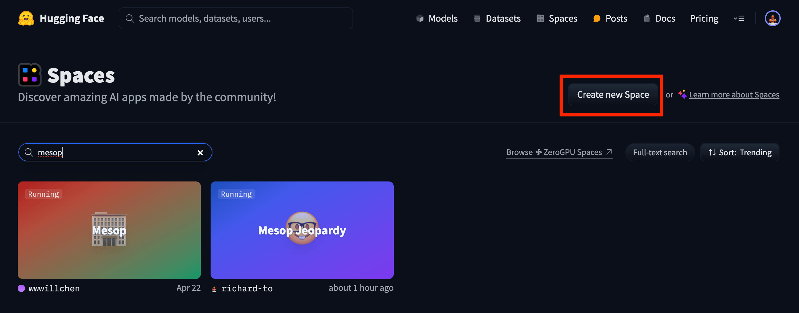
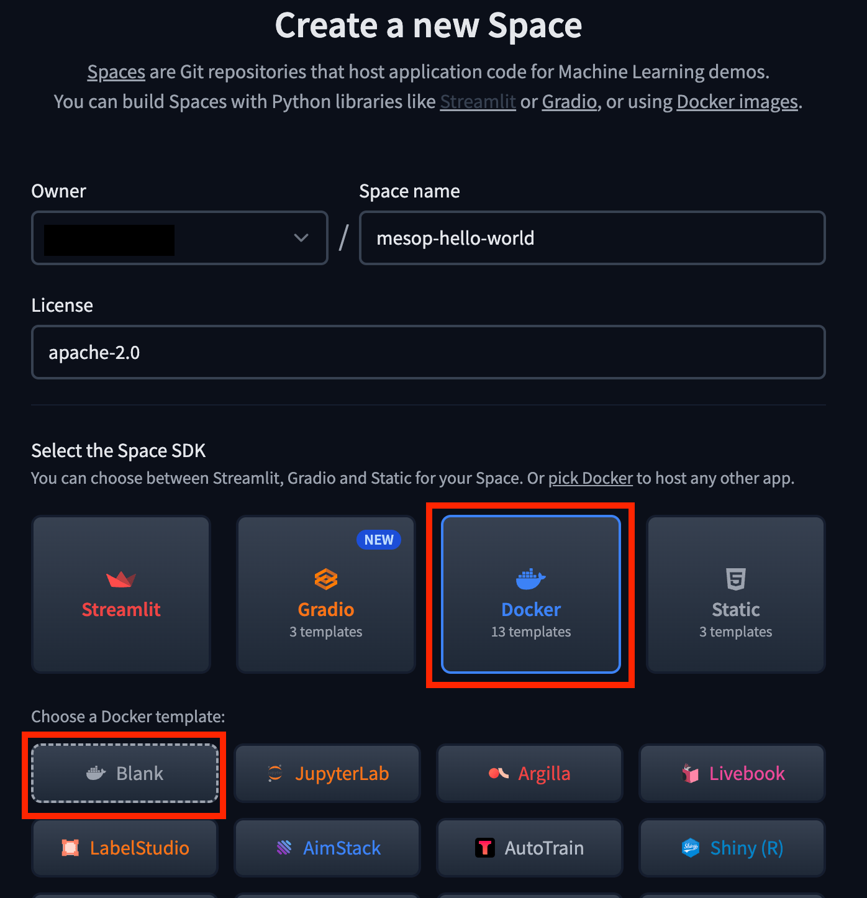
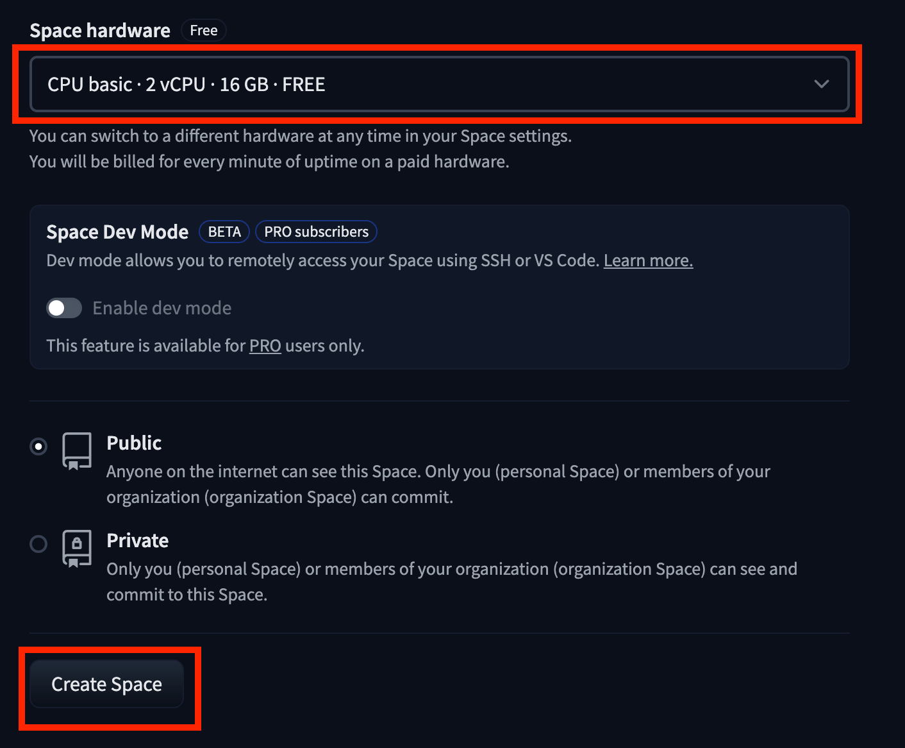
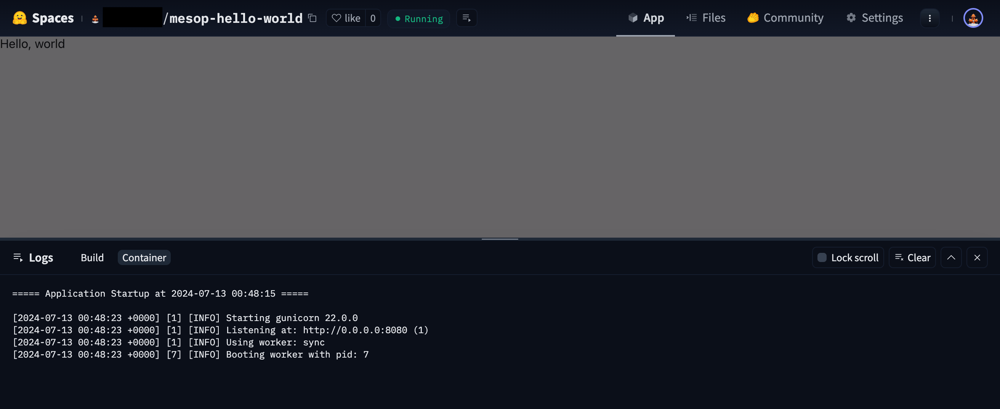

# Deployment

> We recommend Google Cloud Run or Hugging Face Spaces, which both have a free tier.

This section describes how to run your Mesop application using the following
platforms:

- [Google Cloud Run](#cloud-run)
- [Google App Engine](#app-engine)
- [Docker](#docker)
- [Hugging Face Spaces](#hugging-face-spaces)

If you can run your Mesop app on [Docker](https://www.docker.com/), you should be able
to run it on many other cloud platforms, such as
[Hugging Face Spaces](https://huggingface.co/spaces).

## Example application

Let's start with an example application which will consist of the following files:

- main.py
- requirements.txt

### main.py

This file contains your Mesop application code:

```py title="main.py"
import mesop as me

@me.page(title="Home")
def home():
  me.text("Hello, world")
```

### requirements.txt

This file specifies the Python dependencies needed. You may need to add additional
dependencies depending on your use case.

```title="requirements.txt"
mesop
gunicorn
```

## Cloud Run

We recommend using [Google Cloud Run](https://cloud.google.com/run) because it's easy to
get started and there's a [free tier](https://cloud.google.com/run#pricing).

### Pre-requisites

You will need to create a [Google Cloud](https://cloud.google.com/) account and install the [`gcloud` CLI](https://cloud.google.com/sdk/docs/install). See the official documentation for [detailed instructions](https://cloud.google.com/run/docs/quickstarts/build-and-deploy/deploy-python-service#before-you-begin).

### Procfile

Create `Procfile` to configure `gunicorn` to run Mesop.

```title="Procfile"
web: gunicorn --bind :8080 main:me
```

The `--bind: 8080` will run Mesop on port 8080.

The `main:me` syntax is `$(MODULE_NAME):$(VARIABLE_NAME)`: (see [Gunicorn docs](https://docs.gunicorn.org/en/stable/run.html) for more details):

 - Because the Mesop python file is `main.py`, the module name is `main`.
 - By convention, we do `import mesop as me` so the `me` refers to the main Mesop
   library module which is also a callable (e.g. a function) that conforms to WSGI.

### Deploy to Google Cloud Run

In your terminal, go to the application directory, which has the files listed above.

Run the following command:

```sh
gcloud run deploy
```

Follow the instructions and then you should be able to access your deployed app.

### Session Affinity

If you're running Mesop with [MESOP_STATE_SESSION_BACKEND=memory](../api/config.md#mesop_state_session_backend),
then you will want to enable [session affinity](https://cloud.google.com/run/docs/configuring/session-affinity) in order to utilize the `memory` backend efficiently.

The command should be:

```sh
gcloud run services update $YOUR_SERVICE --session-affinity
```

By default gunicorn allocates one worker, but you should double check that gunicorn is
configured correctly for the `memory` backend.

## App Engine

This section describes deployment to [Google App Engine](https://cloud.google.com/appengine) using
their [flexible environments](https://cloud.google.com/appengine/docs/flexible) feature.

### Pre-requisites

You will need to create a [Google Cloud](https://cloud.google.com/) account and install the [`gcloud` CLI](https://cloud.google.com/sdk/docs/install). See the official documentation for [detailed instructions](https://cloud.google.com/appengine/docs/flexible/python/create-app#before-you-begin).

You will also need to run:

```sh
gcloud app create --project=[YOUR_PROJECT_ID]
gcloud components install app-engine-python
```

### app.yaml

Create `app.yaml` to configure App Engine to run Mesop.

```yaml title="app.yaml"
runtime: python
env: flex
entrypoint: gunicorn -b :$PORT main:me

runtime_config:
  operating_system: ubuntu22
  runtime_version: "3.10"

manual_scaling:
  instances: 1

resources:
  cpu: 1
  memory_gb: 0.5
  disk_size_gb: 10
```

### Deploy to App Engine

In your terminal, go to the application directory, which has the files listed above.

Run the following command:

```sh
gcloud app deploy
```

Follow the instructions and then you should be able to access your deployed app.

## Docker

If you can run your Mesop app on [Docker](https://www.docker.com/), you should be able
to run it on many other cloud platforms.

### Pre-requisites

Make sure [Docker and Docker Compose are installed](https://docs.docker.com/engine/install/).

### Dockerfile

```Docker title="Dockerfile"
--8<-- "docs/assets/hf/example.Dockerfile"
```

### docker-compose.yaml

```title="docker-compose.yaml"
services:
  mesop-app:
    build: .
    ports:
      - "8080:8080"
```

### Run Docker image

In your terminal, go to the application directory, which has the files listed above.

Run the following command:

```sh
docker-compose up -d
```

Alternatively, if you do not want to use Docker Compose, you can run:

```sh
docker build -t mesop-app . && docker run -d -p 8080:8080 mesop-app
```

You should now be able to view your Mesop app at http://localhost:8080.


## Hugging Face Spaces

Hugging Face Spaces has a free tier that gives you 2 vCPU and 16GB RAM, which is plenty
for running Mesop applications that leverage generative AI APIs.

### Pre-requisites

This section assumes you already have a free Hugging Face Space account.

### Create new Space

Go to [https://huggingface.co/spaces](https://huggingface.co/spaces) and click
`Create new Space`.



#### Name your app and use Docker SDK

Name the Space `mesop-hello-world` you want and select the `apache-2.0` license.

Next select the Docker SDK with a blank template.



#### CPU Basic and Create Space

Next make sure that you are using the free `CPU Basic` plan. Then click `Create Space`.



### Clone your Hugging Face Space Git Repository

Example command using Git over SSH:

```sh
git clone git@hf.co:spaces/<user-name>/mesop-hello-world
cd mesop-hello-world
```

> Note: You'll need to have an SSH key configured on Hugging Face. See [https://huggingface.co/docs/hub/en/security-git-ssh](https://huggingface.co/docs/hub/en/security-git-ssh).

### Create main.py

This is the same `main.py` file shown earlier, except we need to allow Hugging Face to
iframe our Mesop app.

```py title="main.py"
import mesop as me

@me.page(
  title="Home",
  security_policy=me.SecurityPolicy(
    allowed_iframe_parents=["https://huggingface.co"]
  ),
)
def home():
  me.text("Hello, world")
```

### Create requirements.txt

This file is the same as the generic Docker setup:

```title="requirements.txt"
mesop
gunicorn
```

### Create Dockerfile

This file is the same as the generic Docker setup:

```Docker title="Dockerfile"
--8<-- "docs/assets/hf/example.Dockerfile"
```

### Add app_port in README.md

Next we will need to open port `8080` which we specified in the Dockerfile. This is
done through a config section in the `README.md`.

```md  title="README.md"
---
title: Mesop Hello World
emoji: 🐠
colorFrom: blue
colorTo: purple
sdk: docker
pinned: false
license: apache-2.0
app_port: 8080
---

Check out the configuration reference at https://huggingface.co/docs/hub/spaces-config-reference
```

### Deploy to Hugging Face Spaces

The commands to commit your changes and push to the Hugging Face Spaces git repository
are:

```sh
git add -A
git commit -m "Add hello world Mesop app"
git push origin main
```

### View deployed app

Congratulations! You should now be able to view your app on Hugging Face Spaces.

The URL should be something like this:

```
https://huggingface.co/spaces/<user-name>/mesop-hello-world
```


