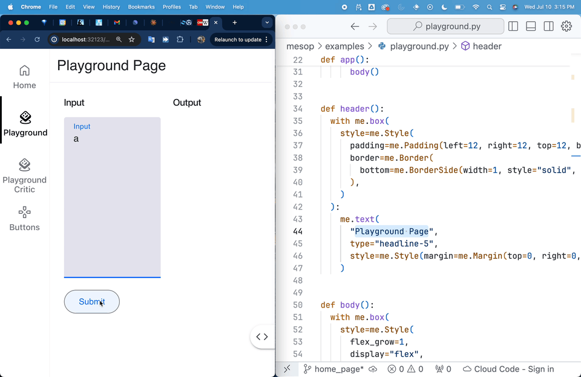
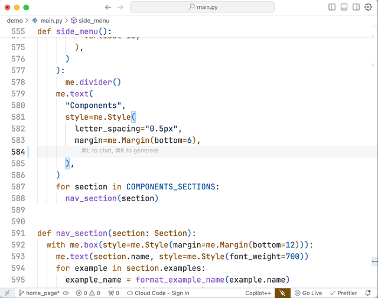

---
hide:
  - navigation
  - toc
---

<style>
  :root {
    --modern-ui-principles-offset: 560px;
  }

  .md-typeset h1 {
    display: none;
  }

  .md-content__inner {
    margin-left: 1.2rem;
    margin-right: 1.2rem;
  }

  .tabbed-set, .highlight {
    max-width: 768px;
  }

  .tabbed-set {
    margin-top: -40px !important;
  }

  #modern-ui-principles + .highlight {
    margin-top: calc(-1 * var(--modern-ui-principles-offset));
  }

  code {
    background: none !important;
  }
</style>

<header>
  <div class="headline">Rapidly build AI apps in Python</div>
  <div class="sub-headline">
    Create web apps without the complexity of frontend development.</br>
    Used at Google for rapid AI app development.
  </div>
  <div class="header-buttons">
    <a class="primary-button" href="./getting-started/installing">Get started</a>
    <a class="secondary-button" href="./showcase">View showcase</a>
  </div>
</header>

<section style="padding: 72px 0">
  <div class="center column">
    <div class="section-headline">
      Create your AI chat app in minutes
    </div>
    <div class="main-demo-iframe-container">
      <iframe src="https://google.github.io/mesop/demo/?demo=embed/chat" class="main-demo-iframe box-shadow"></iframe>
      <div class="embed-overlay">
          <button class="open-button" onclick="openDemoGalleryInNewTab()">
              <svg xmlns="http://www.w3.org/2000/svg" fill="none" viewBox="0 0 24 24" stroke="currentColor">
                  <path stroke-linecap="round" stroke-linejoin="round" stroke-width="2" d="M10 6H6a2 2 0 00-2 2v10a2 2 0 002 2h10a2 2 0 002-2v-4M14 4h6m0 0v6m0-6L10 14" />
              </svg>
              Open in new tab
          </button>
      </div>
    </div>
  </div>
</section>

<script>
function openDemoGalleryInNewTab() {
  window.open('https://google.github.io/mesop/demo/', '_blank');
}
</script>
<section class="container">
  <div class="section-chip teal">Python-native</div>
  <div class="section-headline">
    Write your UI in idiomatic Python
  </div>
  <div class="section-body">
    With Mesop, you can leverage your existing Python expertise to build UIs effortlessly. No new languages to learn - just write clean, idiomatic Python using familiar constructs like functions, loops, and conditionals.
  </div>
</section>

=== "State management"

    ``` python
    @me.stateclass
    class State:
      val: str

    @me.page()
    def page():
        state = me.state(State)
        me.text(state.val)
    ```

=== "Control flow"

    ``` python
    @me.stateclass
    class State:
      is_loaded: bool

    @me.page()
    def page():
        if me.state(State).is_loaded:
          me.text("Loaded")
        else:
          me.progress_spinner()
    ```

=== "Streaming UI"

    ```python
    --8<-- "mesop/examples/docs/streaming.py"
    ```

=== "Composable"

    ``` python
    @me.content_component
    def scaffold(url: str):
      with me.box():
        menu(url=url)
        me.slot()

    @me.component
    def menu(url: str):
      ...

    def page1():
      with scaffold(url="/page1"):
        some_content(...)
    ```


<section id="modern-ui-principles" class="container blue-gradient-background" style="padding-bottom: var(--modern-ui-principles-offset)">
  <div class="section-chip blue">Modern UI principles</div>
  <div class="section-headline">
    Declarative UI that's easy to understand
  </div>
  <div class="section-body">
    Mesop streamlines UI development with a declarative approach. Build expressive, maintainable interfaces using battle-tested patterns in Python. Say goodbye to complex imperative logic and hello to intuitive, clean code.
  </div>
</section>

```py
@me.stateclass
class State:
    image_data: str
    detections: list[Detection]


@me.page()
def object_detector():
    state = me.state(State)

    me.text("Real-time Object Detection", type="headline-4")
    me.uploader(label="Upload an image", on_upload=on_image_upload)

    if state.image_data:
        me.image(src=f"data:image/jpeg;base64,{state.image_data}")

    if state.detections:
        me.text("Detected Objects:", type="headline-5")
        for detection in state.detections:
            detection_component(detection)

def detection_component(detection):
    me.text(f"{detection.obj}: {detection.confidence:.2f}")

def on_image_upload(e: me.UploadEvent):
    state = me.state(State)
    state.image_data = base64.b64encode(e.file.read()).decode()
    state.detections = detect_objects(e.file)
```

<section class="container pink-gradient-background">
  <div class="section-chip pink">Building blocks</div>
  <div class="section-headline">
    Jumpstart with ready-to-use components
  </div>
  <div class="section-body">
    Mesop provides a versatile range of <a href="./components/">30 components</a>, from low-level building blocks to high-level, AI-focused components. This flexibility lets you rapidly prototype ML apps or build custom UIs, all within a single framework that adapts to your project's use case.

    <a class="section-button" href="./components/chat">
      AI components
      <div class="section-button-subtext">e.g. chat, text to image</div>
    </a>
    <a class="section-button" href="./components/input">
      Form components
      <div class="section-button-subtext">e,g. input, checkbox, radio</div>
    </a>
    <a class="section-button" href="./components/table">
      Data display components
      <div class="section-button-subtext">e,g. table, plot</div>
    </a>
  </div>
</section>

<section class="container amber-gradient-background">
  <div class="section-chip amber">Build anything</div>
  <div class="section-headline">
    Build any user interface you can imagine
  </div>
  <div class="section-body">
With Mesop, you can build virtually any web-based user interface or application you can imagine. From quick prototypes to enterprise tools, Mesop provides the customizability to bring your ideas to life.
  </div>
  <iframe src="https://google.github.io/mesop/demo/?demo=embed/chat_inputs" class="chat-inputs-iframe box-shadow"></iframe>
</section>

<section class="container">
  <div class="section-chip teal">Extensible</div>
  <div class="section-headline">
  Seamlessly integrate JS with web components
  </div>
  <div class="section-body">
    Get the best of both worlds with Mesop <a href="./web-components/">web components</a>. Leverage Python's simplicity for core logic, while accessing the vast ecosystem of JS libraries
  </div>
</section>

=== "counter_component.py"

    ```python
    --8<-- "mesop/examples/web_component/quickstart/counter_component.py"
    ```
=== "counter_component.js"

    ```python
    --8<-- "mesop/examples/web_component/quickstart/counter_component.js"
    ```

<section class="container blue-gradient-background">
  <div class="section-chip blue">Simple deployment</div>
  <div class="section-headline">
    Deploy your app and share in minutes
  </div>
  <div class="section-body">
Mesop streamlines cloud deployment, enabling you to share your AI application with the world in minutes. With step-by-step guides for deploying to Google Cloud Run or any cloud service that takes a container, you can go from local development to production-ready deployment without wrestling with complex server setups.
<a class="section-button" href="./guides/deployment/#cloud-run" style="display: flex">

  <div>
      Google Cloud Run
      <div class="section-button-subtext">Free for small apps</div>
      </div>
    </a>
  </div>
</section>

<section class="container pink-gradient-background">
  <div class="section-chip pink">Developer experience</div>
  <div class="section-headline">
    Delightful developer experience
  </div>
  <div class="section-body">
Mesop streamlines app development with features like hot reload and strong IDE support with static types, eliminating friction and boosting productivity.
</div>
  <div class="dev-gif-row">
    <div class="gif-caption">
      Instant hot reload
    </div>
    
  </div>
  <div class="dev-gif-row row-reverse">
  <div class="gif-caption">
      IDE support with static types
    </div>
    
  </div>
</section>

<section class="container teal-gradient-background">
  <div class="section-chip teal">Community</div>
  <div class="section-headline">
    See what others are saying
  </div>
  <div class="section-body">
 Join developers around the world who are building AI apps in Mesop.
  </div>
    <div class="center">
      <iframe
        class="youtube-embed box-shadow"
        style="margin-bottom: 16px"
        width="560"
        height="315"
        src="https://www.youtube.com/embed/Zi1DnGOrYho?si=DYNApUBow3AfT47y"
        title="YouTube video player"
        frameborder="0"
        allow="accelerometer; autoplay; clipboard-write; encrypted-media; gyroscope; picture-in-picture; web-share"
        referrerpolicy="strict-origin-when-cross-origin"
        allowfullscreen
      ></iframe>
    </div>
      <div class="twitter-row">
        <blockquote class="twitter-tweet">
          <p lang="en" dir="ltr">
            is this the thing that will finally save me from ever learning front
            end?<a href="https://t.co/eDgY0AfG6U">https://t.co/eDgY0AfG6U</a>
          </p>
          &mdash; xlr8harder (@xlr8harder)
          <a
            href="https://twitter.com/xlr8harder/status/1798673386425786724?ref_src=twsrc%5Etfw"
            >June 6, 2024</a
          >
        </blockquote>
        <script
          async
          src="https://platform.twitter.com/widgets.js"
          charset="utf-8"
        ></script>

        <blockquote class="twitter-tweet">
          <p lang="en" dir="ltr">
            i hate writing frontend code, but can’t resist a sleek UI. just
            tried Google’s quietly released Mesop—what a find! no frontend fuss,
            just python. <br /><br />if you value your sanity and good design,
            you should def try it. gives a balance between streamlit and
            gradio<br /><br />mesop docs :…
            <a href="https://t.co/SmBAH5Leri">pic.twitter.com/SmBAH5Leri</a>
          </p>
          &mdash; Sanchay Thalnerkar (@7anchay)
          <a
            href="https://twitter.com/7anchay/status/1804890091816644906?ref_src=twsrc%5Etfw"
            >June 23, 2024</a
          >
        </blockquote>
        <script
          async
          src="https://platform.twitter.com/widgets.js"
          charset="utf-8"
        ></script>

        <blockquote class="twitter-tweet">
          <p lang="en" dir="ltr">
            New Python-based UI framework in town - have you tried Mesop from
            Google?<br /><br />I gave it a spin, here&#39;s what I found out:<br /><br />📌
            Provides a unique approach to building web hashtag#UIs in
            hashtag#Python with component-based architecture for customized UIs
            by taking inspiration from…
          </p>
          &mdash; Harshit Tyagi (@dswharshit)
          <a
            href="https://twitter.com/dswharshit/status/1800557173073691000?ref_src=twsrc%5Etfw"
            >June 11, 2024</a
          >
        </blockquote>
        <script
          async
          src="https://platform.twitter.com/widgets.js"
          charset="utf-8"
        ></script>
</section>

## Disclaimer

_This is not an officially supported Google product._
