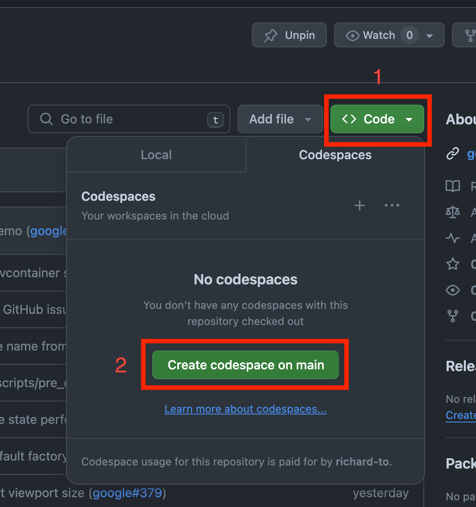
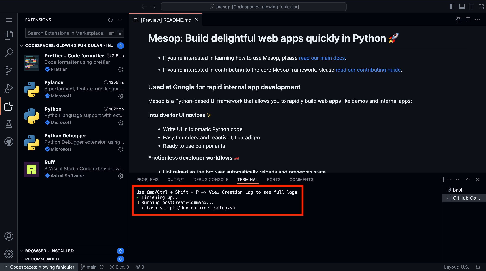
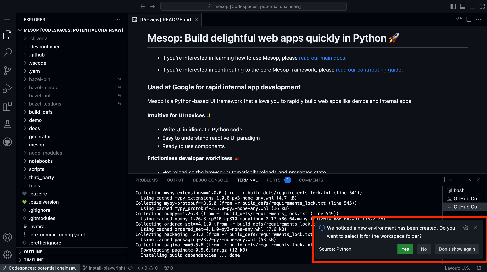
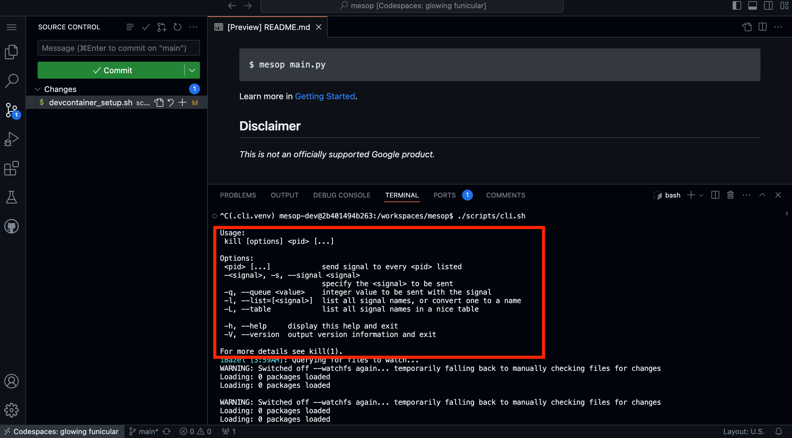
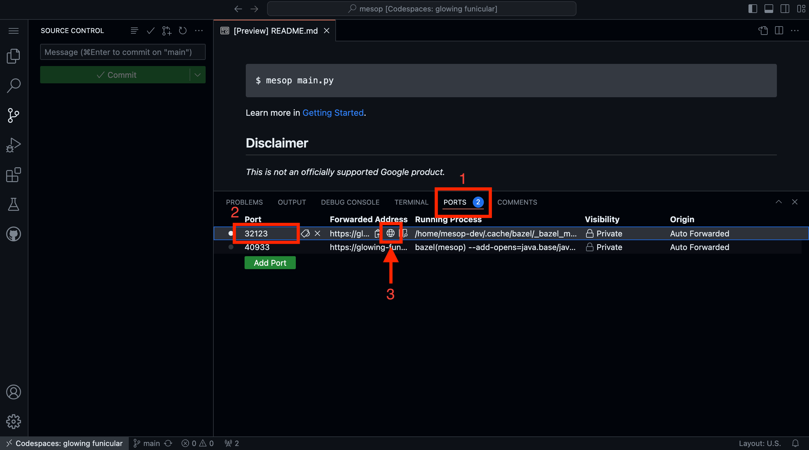

# Development on Github Codespaces

[Github Codespaces](https://github.com/features/codespaces) is a quick way to get
started with internal Mesop development. All you need to do is a click a button and a
fully configured workspace will be created for you. No need to spend time debugging
installation issues.

Github Free and Pro plans also provide a [free tier](https://github.com/features/codespaces),
so Codespaces is useful for writing and testing quick patches.

> If using the free tier, the Codespace setup takes 20-30 minutes due to the limited
CPU available.

## Create Github Codespace

You can create a Github Codespace from the [Mesop Github repository page](https://github.com/google/mesop).



## Wait for postCreateCommand to run

The Codespace will not be usable until the `postCreateCommand` has completed. You can
view the CLI output by pressing `Cmd/Ctrl + Shift + P` and then finding the `View
Creation Log` option.



## Set the Python environment for the Codespace

During the `postCreateCommand` step, you'll see a pop up asking if you want to set a new
environment for the Codespace. Select `Yes` here to use the virtual env that is created
as part of the `postCreateCommand` set up.



## Run Mesop for development

Once the `postCreateCommand` has finished, you can now start Mesop in the terminal.

```
./scripts/cli.sh
```

This step takes some time for the first run.

You will see some warning messages, but it is OK to ignore them. You can also ignore the
message shown in the screenshot.




## View Mesop demos

Once `./scripts/cli.sh` has started the Mesop dev server, you can view the demos from
the `PORTS` tab.


