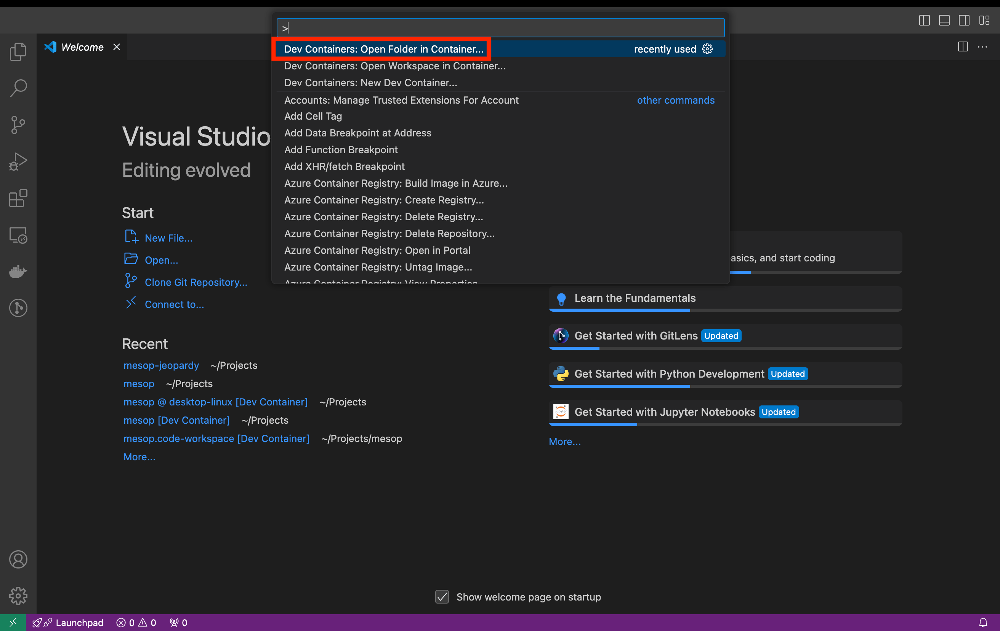

# VS Code Remote Container

VS Code Remote Containers is a quick way to get started with internal Mesop
development if you have [VS Code](https://code.visualstudio.com/) and
[Docker Desktop](https://www.docker.com/products/docker-desktop/) installed.

This approach will create a fully configured workspace, saving you time from
debugging installation issues and allowing you to start development right away.

## Pre-requistes: Install VS Code and Docker

In order to use VS Code remote containers, you will need VS Code installed. You will
also need Docker Desktop (which will install Docker Engine and Docker Compose) to run
the remote containers.

- [VS Code](https://code.visualstudio.com/)
- [Docker Desktop](https://www.docker.com/products/docker-desktop/)

## Fork and Clone the Mesop repository

> It is not recommended to develop locally and on remote containers using the same
folder since this may cause unexpected conflicts. Instead you should clone the
repository in a separate directory.

You can follow the instructions here on [how to fork and clone a Github repository](https://docs.github.com/en/pull-requests/collaborating-with-pull-requests/working-with-forks/fork-a-repo).

## Share Git credentials with your container

The VS Code Dev Containers extension provides a few ways to share your local Git
credentials with your remote container.

If you cloned the Mesop repo using HTTPS, you can use a [Github CLI or Git Credential Manager](https://docs.github.com/en/get-started/getting-started-with-git/caching-your-github-credentials-in-git).

If you used SSH, then your local ssh agent will automatically be forwarded into your
remote container. All you need do is run the `ssh-add` command to add the ssh key you've
configured for GitHub access.

See the [Sharing Git credentials with your container page](https://code.visualstudio.com/remote/advancedcontainers/sharing-git-credentials) for full details.

## Open folder in container

Open VS Code, press `Cmd/Ctrl + Shift + P`, and select the `Dev Containers: Open Folder in Container...`
option. This will create a new workspace inside a remote container.



## Wait for postCreateCommand to run

The workspace will not be usable until the `postCreateCommand` has completed.


## Run Mesop for development

Once the `postCreateCommand` has finished, you can now start Mesop in the terminal.

```
./scripts/cli.sh
```

You will see some warning messages, but it is OK to ignore them.

You should see this message once the Mesop server is ready.


## View Mesop demos

Once `./scripts/cli.sh` has started the Mesop dev server, you can view the demos at
http://localhost:32123.
