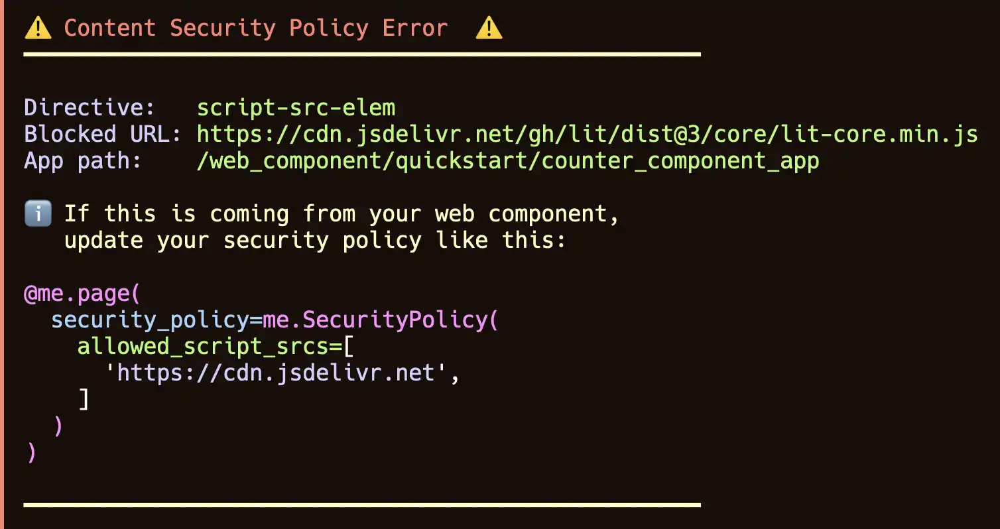

# Web Components Troubleshooting

## Security policy

One of the most common issues when using web components is that you will need to relax the stringent security policy Mesop uses by default.

If you use the `mesop` command-line tool to run your app, you will see a detailed error message printed like this that will tell you how to fix the error:



If you are using Colab or another tool to run your Mesop app, and you can't see the terminal messages, then you can use your browser developer tools to view the console error messages.

### Content security policy error messages

In your browser developer tools, you may see the following console error messages (the exact wording may differ):

#### script-src Error

???+ failure "script-src Console Error"
    Refused to load the script 'https://cdn.jsdelivr.net/gh/lit/dist@3/core/lit-core.min.js' because it violates the following Content Security Policy directive: "script-src 'self' 'nonce-X-_ZR64fycojGBCDQbjpLA'". Note that 'script-src-elem' was not explicitly set, so 'script-src' is used as a fallback.

If you see this error message, then you will need to update your page's [Security Policy](../api/page.md#mesop.security.security_policy.SecurityPolicy) `allowed_script_srcs` property. In this example, because the "script-src" directive was violated, you will need to add the script's URL to the Security Policy like this:

```py
@me.page(
    security_policy=me.SecurityPolicy(
        allowed_script_srcs=["https://cdn.jsdelivr.net"]
    )
)
```

???+ tip "Allow-listing sites"
     You can allow-list the full URL including the path, but it's usually more convenient
     to allow-list the entire site. This depends on how trustworthy the site is.

#### connect-src Error

???+ failure "connect-src Console Error"
    zone.umd.js:2767 Refused to connect to 'https://identitytoolkit.googleapis.com/v1/projects' because it violates the following Content Security Policy directive: "default-src 'self'". Note that 'connect-src' was not explicitly set, so 'default-src' is used as a fallback.


If you see this error message, then you will need to update your page's [Security Policy](../api/page.md#mesop.security.security_policy.SecurityPolicy) `allowed_connect_srcs` property. In this example, because the "connect-src" directive was violated, you will need to add the URL you are trying to connect to (e.g. XHR, fetch) to the Security Policy like this:

```py
@me.page(
    security_policy=me.SecurityPolicy(
        allowed_connect_srcs=["https://*.googleapis.com"]
    )
)
```

???+ tip "Allow-listing domains using wildcard"
     You can wildcard all the subdomains for a site by using the wildcard character `*`.

#### Trusted Types Error

Trusted Types errors can come in various forms. If you see a console error message that contains TrustedHTML, TrustedScriptURL or some other variation, then you are likely hitting a trusted types error. Trusted Types is a powerful web security feature which prevents untrusted code from using sensitive browser APIs.

Unfortunately, many third-party libraries are incompatible with trusted types which means you need to disable this web security defense protection for the Mesop page which uses these libraries via web components.

???+ failure "TrustedHTML Console Error"

    TypeError: Failed to set the 'innerHTML' property on 'Element': This document requires 'TrustedHTML' assignment.

You can fix this Trusted Types error by disabling Trusted Types in the security policy like this:

```py
@me.page(
    security_policy=me.SecurityPolicy(
        dangerously_disable_trusted_types=True
    )
)
```
